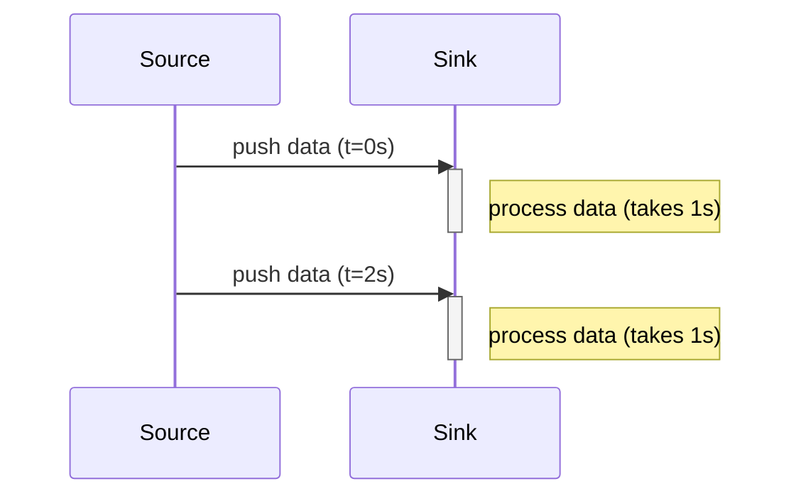
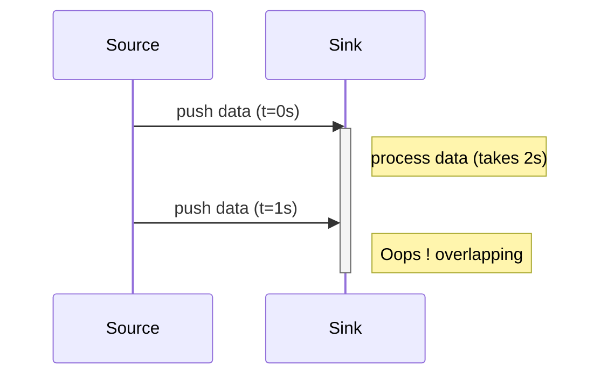
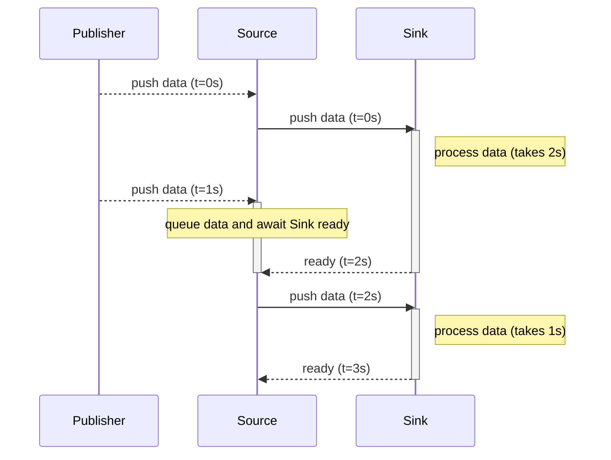
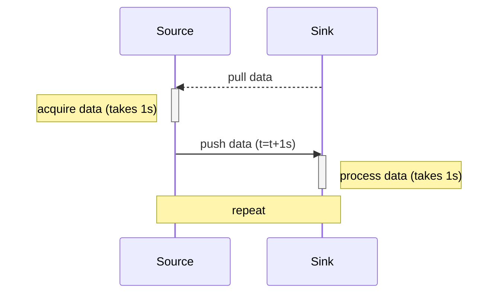
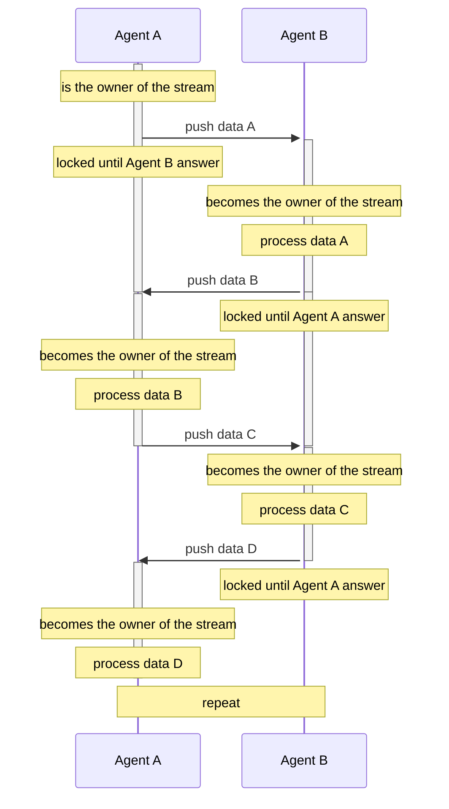

# Why Flow ?

Streams are one of the most challenging and important concepts in computing.
They are at the core of information processing, which is the predominant use of computers.
As such, they have been studied extensively, with many different implementations, approaches, and architectures - and they continue to raise many questions.

As an example, when choosing a Stream we must first answer these questions:

- PUSH vs PULL ?
- SINGULAR vs PLURAL ?
- SYNC vs ASYNC ?
- queued ?
- with backpressure ?

And then choose the right implementation:

- [Observables](https://wicg.github.io/observable/) ([and all the declinations](https://github.com/WICG/observable?tab=readme-ov-file#userland-libraries))
- [Iterator](https://developer.mozilla.org/en-US/docs/Web/JavaScript/Reference/Global_Objects/Iterator) / [AsyncIterator](https://developer.mozilla.org/en-US/docs/Web/JavaScript/Reference/Global_Objects/AsyncIterator)
- [ReadableStream](https://developer.mozilla.org/en-US/docs/Web/API/ReadableStream) / [WritableStream](https://developer.mozilla.org/en-US/docs/Web/API/WritableStream)
- [Signals](https://github.com/tc39/proposal-signals)
- and many others...

Each of them has its advantages and disadvantages, strengths and weaknesses.
Thus, after a long journey, I came up with some rules to define what, in my opinion, would make the 'perfect' stream.

## A) A stream should be a ping-pong game

### First let's recap the kind of streams

#### The push stream

A `push` stream is a stream that sends values without being explicitly requested:



However, if the `Sink` is _slower_ that the `Source`,
it may receive more values than it can handle, resulting in unexpected behavior (the `Sink` may crash, become saturated, lose data, etc.).



For example, [Observables](https://wicg.github.io/observable/) fall into this category.

Therefore, we usually implement a _queue_ and a _backpressure_ mechanism:



This can be partially achieved using [AsyncIterator](https://developer.mozilla.org/en-US/docs/Web/JavaScript/Reference/Global_Objects/AsyncIterator):

```ts
const iterator: AsyncIterator<void, void, number> = /*...*/;

await iterator.next(0);
await iterator.next(1);
// etc...
```

#### The pull stream

A `pull` stream is a stream that asks for values:



But it faces the sames limitations as a `push` stream:

- the Source could become _saturated_ (if we pull too much).
- if the _data_ comes from an "external" event, we need to implement a "buffer/queue" mechanism, as we may pull much later than the original data was generated.

As a consequence, implementations like [AsyncIterator](https://developer.mozilla.org/en-US/docs/Web/JavaScript/Reference/Global_Objects/AsyncIterator) typically _queue_ the `pulls` and provide a _backpressure_ mechanism.

```ts
const iterator: AsyncIterator<number, void, void> = /*...*/;

console.log(await iterator.next()); // first value
console.log(await iterator.next()); // second value
// etc...
```

### My opinion

To address these limitations, I concluded that the best solution is a ping-pong flow:



It eliminates the notion of `Source` and `Sink`, as both give and acquire ownership of the stream alternately.

This pattern ensures that data is queued and backpressured, so no one becomes flooded.

Moreover, it becomes easy to specialize this flow:

- a `readable` flow is simply a: `push` no data (`void`), `receive` a value.
- a `writable` flow is simply a: `push` a value, `receive` no data (`void`).

### Interfaces

To implement this flow, I arrived at this interface:

```ts
interface AsyncFlow<GArguments extends readonly unknown[], GReturn> {
  new(
    next: AsyncFlowNextCallback<GArguments, GReturn>,
  );
  
  next(...args: GArguments): Promise<GReturn>;
}
```

With:

```ts
interface AsyncFlowNextCallback<GArguments extends readonly unknown[], GReturn> {
  (...args: GArguments): PromiseLike<GReturn> | GReturn;
}
```

Example:

```ts
const agentA: AsyncFlow<[number], string> = new AsyncFlow<[number], string>(/* agentB */ async (value: number): Promise<string> => {
  // agentB is contained somewhere within the AsyncFlow, but it is hidden from agentA
  await sleep(1000); // a function that returns a Promise resolved after 1s
  return value.toString(16); // => converts the input value into an hex string
});

const answer: string = await agentA.next(0xfa80b4); // 'fa80b4'
```

Calling `agentA.next(fa80b4)` sends data to `agentB`, which is a script defined during the construction of the `AsyncFlow`.
As a consequence, `agentB` becomes the owner of the stream and immediately returns a `Promise`, allowing it to respond later.
When the Promise resolves, `agentB` once again becomes the owner of the stream, and the process can be repeated.

Note that `next` calls are internally queued to prevent overflowing `agentB`.

#### Specializations

We can then specialize this interface:

```ts
type AsyncReader<GValue> = AsyncFlow<[], GValue>;
```

```ts
type AsyncWriter<GValue> = AsyncFlow<[GValue], void>;
```

An `AsyncReader` is simply an `AsyncFlow` that takes no input but returns a value.
In contrast, an `AsyncWriter` is an `AsyncFlow` that takes a value as input and returns nothing.

## B) A stream should be closable

A stream usually _acquires_ a resource: it may be a file lock, a timer, an HTTP request, etc.

In addition, in the ping-pong flow, we need a mechanism to notify the agents that we are no longer interested in the stream,
and as a consequence, they may release their resources and stop processing the data.

This point is _universal_:  all implementations include such functionality, as it is critical for a stream.

The implementations diverge on whether this cancellation should be synchronous or not.
For my part, I believe it should be asynchronous, as some resources can only be released asynchronously.

### Interface

```ts
interface AsyncFlow<GArguments extends readonly unknown[], GReturn> {
  new(
    next: AsyncFlowNextCallback<GArguments, GReturn>,
    close?: AsyncFlowCloseCallback | undefined,
  );
  
  // next(...)
  
  readonly closed: boolean;

  throwIfClosed(): void;

  close(reason?: unknown): Promise<void>;

  [Symbol.asyncDispose](): Promise<void>;
}
```

With:

```ts
interface AsyncFlowNextCallback<GArguments extends readonly unknown[], GReturn> {
  (...args: AsyncFlowNextArguments<GArguments>): PromiseLike<GReturn> | GReturn;
}

type AsyncFlowNextArguments<GArguments extends readonly unknown[]> = readonly [
  ...args: GArguments,
  signal: AbortSignal,
];
```

Example:

```ts
await using agentA: AsyncFlow<[number], string> = new AsyncFlow<[number], string>(
  /* agentB */ async (value: number, signal: AbortSignal): Promise<string> => {
    await sleep(1000, signal); // a function that returns a Promise resolved after 1s, or rejected if the `signal` is aborted during this period.
    return value.toString(16);
  }, 
  (): void => {
    console.log('closed');
  },
);

const answer: string = await agentA.next(0xfa80b4); // 'fa80b4'
// agentA[Symbol.asyncDispose]() is automatically called, resulting in the abortion of the stream, thus logging 'closed' to the console.
```

Here, the role of the `close` function is to cancel the stream, usually when we're no longer interested in it.
It may happen any time the owner of the `AsyncFlow` reference want to end the stream.

When `close` is called, the following happens:

- If the stream is already closed, do nothing.
- Else, if `close` is called while the ownership is with `agentB`,
  the provided `signal` to `agentB` is aborted  as a consequence, and the `agentB`'s role is to reject if this occurs.
- We then await the completion of all queued operations.
- Finally, the provided `close` callback for the `AsyncFlow` is called.

The returned `Promise` is resolved once all of these processes are complete.

Note that calls to `next` after abortion will result in a rejected `Promise`.

## C) A stream should be openable

As said previously, a stream usually _acquires_ a resource, thus it must provide a mechanism to construct the flow.

I believe that such an operation must be _asynchronous_ and _cancellable_.
The reason is that asynchronous opening can handle synchronous resource acquisition, but not the other way around.
The same applies to abortion as well.
As the saying goes: 'He who can do more can do less.'

Now, we should acknowledge some limitations to take into consideration:

- Once a stream is opened, any piece of code that obtains - or still holds - a reference to it may call `next`, potentially creating unwanted concurrency.
For example, if two components consume the same `AsyncFlow` while `next` calls are queued, each component might receive only a portion of the data instead of the full stream.
This is behavior we clearly want to avoid. ReadableStream offers a [tee](https://developer.mozilla.org/en-US/docs/Web/API/ReadableStream/tee) method to handle such cases, but it often proves impractical.
- Another option is to share the stream immediately: multiple calls to [Observable.subscribe](https://wicg.github.io/observable/#observable-subscribe-to-an-observable) do not create a new flow if the previous one is still active.
However, this clearly limits what can be done with the stream and runs counter to the philosophy of this proposal - remember the ping-pong flow.

As a result, I assert that opening a stream should always _create a new flow_.

### Interface

Let's build an interface that takes all these aspects into consideration:

```ts
interface AsyncFlowFactory<GAsyncFlow extends GenericAsyncFlow> {
  new(open: AsyncFlowFactoryOpenCallback<GAsyncFlow>);

  open(signal?: AbortSignal): Promise<GAsyncFlow>;
}
```

With:

```ts
interface AsyncFlowFactoryOpenCallback<GAsyncFlow extends GenericAsyncFlow> {
  (signal?: AbortSignal): PromiseLike<GAsyncFlow> | GAsyncFlow;
}
```

Example:

```ts
import { CompleteError } from '@xstd/custom-error';
import { opendir, type Dir, type Dirent } from 'node:fs/promises';

function directoryReader(path: string): AsyncFlowFactory<AsyncFlow<[], Dirent>> {
  return new AsyncFlowFactory<AsyncFlow<>[], Dirent>(async (): AsyncFlow<[], Dirent> => {
    const dir: Dir = await opendir(path);

    return new AsyncFlow<[], Dirent>(
      async (): Dirent => {
        const dirent: Dirent | null = await dir.read();
        if (dirent === null) {
          throw new CompleteError();
        }
        return dirent;
      },
      async (): Promise<void> => {
        await dir.close();
      },
    );
  });
}

const readable: AsyncFlowFactory<AsyncFlow<[], Dirent>> = directoryReader('.');

async function readDirectory(): Promise<void> {
  await using reader: AsyncFlow<[], Dirent> = readable.open();

  while (true) {
    try {
      console.log(await reader.next());
    } catch (error: unknown) {
      if (error instanceof CompleteError) {
        break;
      }
      throw error;
    }
  }
}

readDirectory();
```

And that's it! I believe these three rules are the most important for creating a stream with a robust foundation.

## Questions and answers

### Is it necessary to have another Stream implementation ?

**Yes.** Streams are in constant evolution. There are countless ways to approach them - each with its own strengths and trade-offs.

Designing a robust stream library typically demands deep knowledge, many iterations, time, successes, and failures.
It's **not an easy task**, as each implementation attempts to solve specific shortcomings found in others.

There is no universal answer - the best solution often depends on the context, how the streams will be used, and what requirements matter most in a given scenario.

For example, if your project benefits more from synchronous streams, then `Flow` might not be what you're looking for - you'd likely prefer a more specialized implementation tailored to your specific needs.

`Flow` is designed to be more generic, modeling communication between two abstract endpoints that alternate ownership.
Rather than assigning fixed roles like Source and Sink, `Flow` promotes a ping-pong interaction where each side takes turns controlling the stream.

### Comparisons

#### Comparison with ReadableStream/WritableStream

[ReadableStream](https://developer.mozilla.org/en-US/docs/Web/API/ReadableStream)/[WritableStream](https://developer.mozilla.org/en-US/docs/Web/API/WritableStream) 
try to conciliate many of explained problematics. Among them, we find: cancellation, lock (while reading), queuing, backpressure, push and pull.

However, I think that too much as been placed into the API: it creates confusion an inefficiencies.

For example:

1. The API handles the concurrency though the methods `.getReader()/.getWriter()` to acquire a lock on the stream. 
  If it was not done, it would be possible to consume the stream "twice or more" resulting in currency: 

```ts
// a function to convert values of a ReadableStream into another type
function map<GIn, GOut>(readable: ReadbleStream<GIn>, map: (input: GIn) => GOut): ReadbleStream<GOut> {
  return new ReadbleStream<number>(/* map the data ... */));
}

// a ReadbleStream of numbers
const readableA = new ReadbleStream<number>([1, 2, 3]);
// converts numbers in string
const readableB = map(readble, String);

// aquire a lock on the ReadbleStream
const readerB = readableB.getReader();
// read a value
console.log(await readerB.read());

// note that we still have access to `readableA`, so we can do the following:
const readerA = readableA.getReader();
// => hopefully, `readableA` is locked, and an error is generated.
// if it was not the case, calling `readerA.next()` whould consume a value, thus creating a "skiped" value for `readerB`
```

This reflects a deep understanding of streams, but I personally believe the implementation is not optimal.
Indeed, in order to consume a stream more than once, we have to call the [tee](https://developer.mozilla.org/en-US/docs/Web/API/ReadableStream/tee) method.

This becomes impractical - especially when N distinct sources need to read from the same `ReadableStream` concurrently.

2. There's no "_replay_" of the stream:
   Once a `ReadableStream` is opened with the first `.read()`, there's no way to replay it.
   Typically, you need to call a function that generates a new stream and rebuild the entire pipeline from scratch.

That's why I came to conclusion `C`: a stream should be openable.
This architecture addresses both concurrency control and replayability, as a new pipeline is created with each invocation of `.open(...)`.

#### Comparison with AsyncGenerators

[AsyncGenerators](https://developer.mozilla.org/en-US/docs/Web/JavaScript/Reference/Global_Objects/AsyncGenerator) are really close of the "ideal" stream.

With just a few tweaks, they come close to following the three rules outlined here - but they don't match them exactly.

For example, _abortion_ is handled through `.return()` or `.error()` but it's easy to trick the system into creating infinite 'termination' loops:

```ts
const a = (async function* () {
  while (true) {
    try {
      yield 1;
    } finally {
      continue;
    }
  }
})();

console.log(await a.next());
// => loops indefinitivelly
console.log(await a.return());
console.log(await a.return());
console.log(await a.return());
```


Moreover, the async generator function's context is unaware of any abortion while it's running - there's no `AbortSignal` available.

hen, there are other issues - for example, the first value passed to`.next(value)` cannot be accessed from within the async generator function's context.

They’re _almost_ ideal, but these few limitations led me to explore a different implementation.

#### Comparison with Observables

[Observables](https://wicg.github.io/observable/) are **synchronous push** sources, but they lack several key features:

- **Backpressure**: An `Observable` pushes values synchronously, so the `Observer` can only express backpressure in a synchronous way (e.g., by blocking the main thread).
  As a result, an `Observable` cannot support a ping-pong model in an asynchronous context, which disqualifies it for such use cases.
- **Asynchronous disposal**: While an `Observable` can mimic asynchronous opening (since values can be emitted later), it cannot express an asynchronous closing process - there's no native support for async teardown or cleanup.
- **Concurrent subscriptions**: A WICG Observable shares active subscriptions when multiple subscribe calls are made before the previous one completes.
 This makes it difficult - or impossible - to create a fresh instance for each opening.

