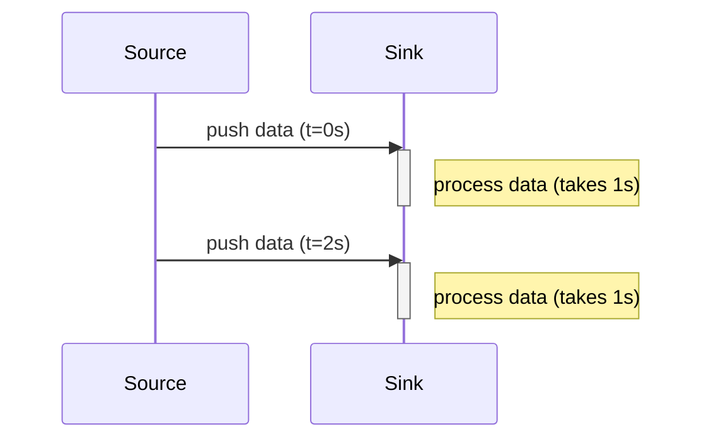
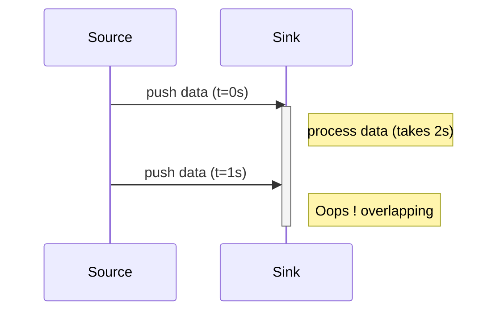
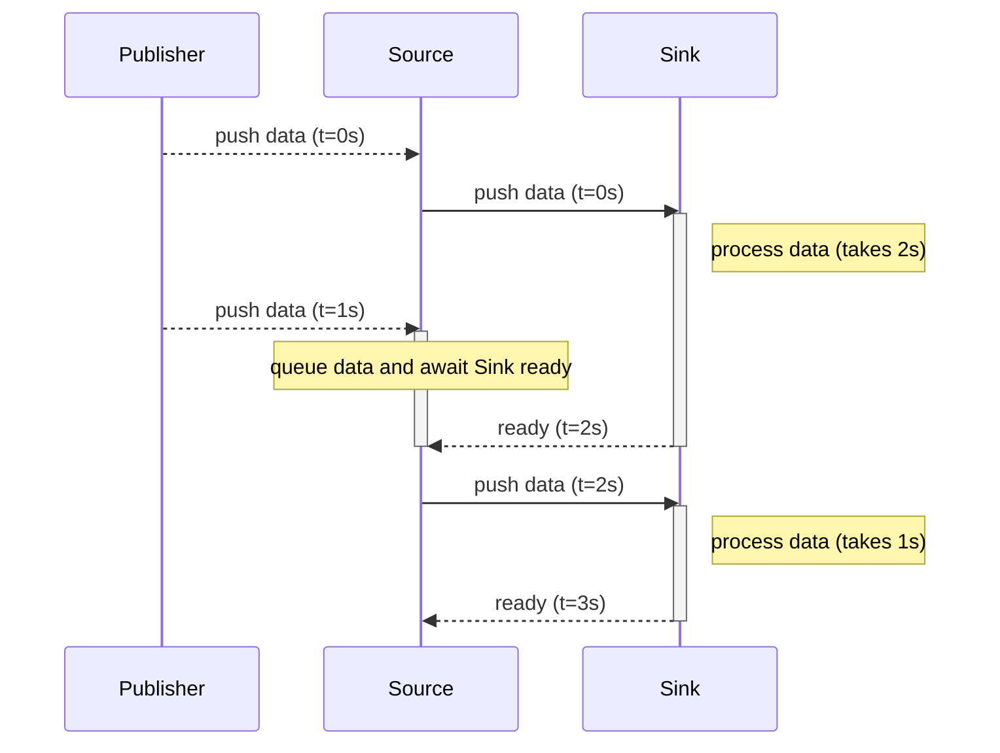
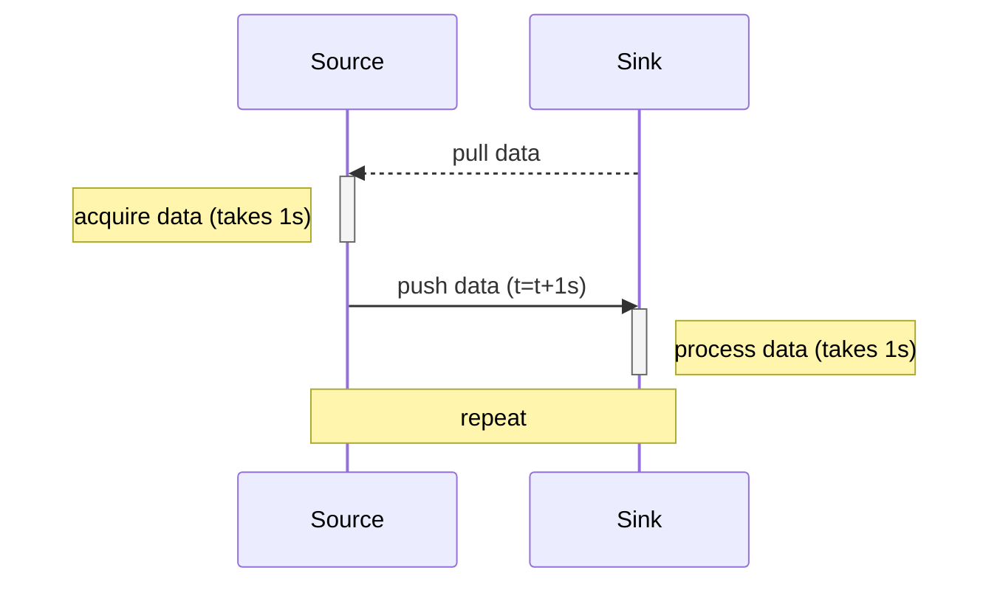
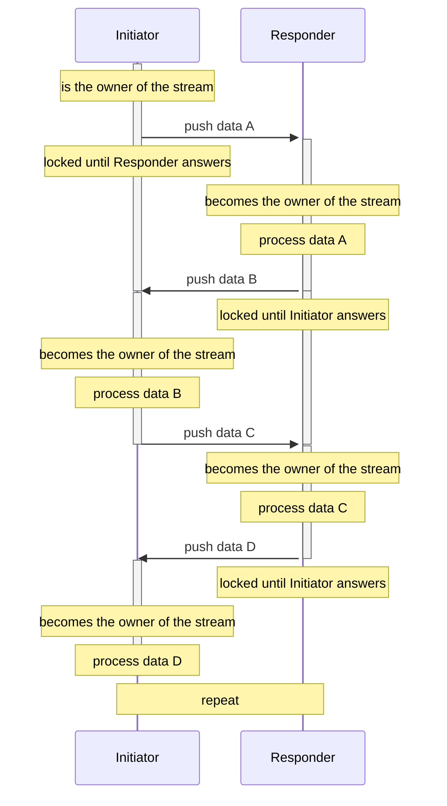
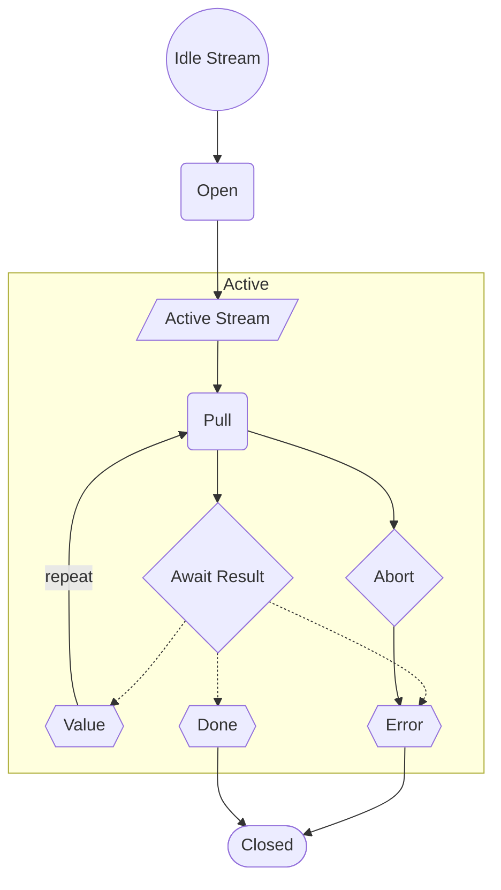

# Why Flow ?

Streams are one of the most challenging and important concepts in computing.
They are at the core of information processing, which is the predominant use of computers.
As such, they have been studied extensively, with many different implementations, approaches, and architectures - and they continue to raise many questions.

As an example, when choosing a Stream we must first answer these questions:

- PUSH vs PULL ?
- SINGULAR vs PLURAL ?
- SYNC vs ASYNC ?
- queued ?
- with backpressure ?

And then choose the right implementation:

- [Observables](https://wicg.github.io/observable/) ([and all the declinations](https://github.com/WICG/observable?tab=readme-ov-file#userland-libraries))
- [Iterator](https://developer.mozilla.org/en-US/docs/Web/JavaScript/Reference/Global_Objects/Iterator) / [AsyncIterator](https://developer.mozilla.org/en-US/docs/Web/JavaScript/Reference/Global_Objects/AsyncIterator)
- [ReadableStream](https://developer.mozilla.org/en-US/docs/Web/API/ReadableStream) / [WritableStream](https://developer.mozilla.org/en-US/docs/Web/API/WritableStream)
- [Signals](https://github.com/tc39/proposal-signals)
- and many others...

Each of them has its advantages and disadvantages, strengths and weaknesses.
Thus, after a long journey, I came up with some rules to define what, in my opinion, would make the 'perfect' stream.

## A stream should be a ping-pong game

### First let's recap the kind of streams

#### The push stream

A `push` stream is a stream that sends values without being explicitly requested:



However, if the `Sink` is _slower_ that the `Source`,
it may receive more values than it can handle, resulting in unexpected behavior (the `Sink` may crash, become saturated, lose data, etc.).



For example, [Observables](https://wicg.github.io/observable/) fall into this category.

Therefore, we usually implement a _queue_ and a _backpressure_ mechanism:



#### The pull stream

A `pull` stream is a stream that asks for values:



We may notice that it faces the sames limitations as a `push` stream:

- the Source could become _saturated_ (if we pull too much).
- if the _data_ comes from an "external" event, we need to implement a "buffer/queue" mechanism, as we may pull much later than the original data was generated.

### Solution

To address these limitations, I concluded that the best solution is a ping-pong flow:



It eliminates the notion of `Source` and `Sink`, as both give and acquire ownership of the stream alternately.

This pattern ensures that data is queued and backpressured, so no one becomes flooded.

Moreover, it becomes easy to specialize this flow:

- a `readable` flow is simply - `pushes` no data (`void`), `receives` a value.
- a `writable` flow is simply - `pushes` a value, `receives` no data (`void`).
- a `duplex` flow follows the ping-pong pattern - it `pushes` and `receives` data alternativelly.


## A stream should have its own lifecycle

1) A stream starts in a _closed_ state.
1) Later, it may be _opened_ - when happening, it typically _acquires_ some resources (such as a file lock, a timer, an HTTP request, etc.).
1) It then sends or receives values.
1) Finally, it may end with _completion_, an _error_, or _cancellation_ (during this phase, it releases its resources and stops processing data).



### AsyncStepper

From these rules, we can define a `AsyncStepper` interface:

```ts
interface AsyncStepper<GIn, GOut, GReturn, GArguments extends readonly unknown[]> {
  open(signal: AbortSignal, ...args: GArguments): AsyncEnumeratorObject<GIn, GOut, GReturn>;
}

interface AsyncEnumeratorObject<GIn, GOut, GReturn> {
  next(value: GIn): Promise<EnumeratorResult<GOut, GReturn>>;
  throw(error?: unknown): Promise<EnumeratorResult<GOut, GReturn>>;
  return(value: GReturn): Promise<EnumeratorResult<GOut, GReturn>>;
}
```

#### AsyncStepper.open

The `AsyncStepper.open` method is the entry point to the stream.
A **required** `AbortSignal` is provided to allow canceling the stream.

In this scheme, the opener is called an `Initiator`, and, while iterating over the stream, it will periodically exchange the stream's controls with a `Responder`.

The `open` function returns an `AsyncEnumeratorObject` that provides the ping-pong mechanism to communicate between the two:

1) `AsyncEnumeratorObject.next/error/return`: the `Initiator` _steps_
   - `next(value)`: the `Initiator` sends a _value_ to the `Responder`
   - `error(error)`: the `Initiator` sends an _error_ to the `Responder`
   - `return(value)`: the `Initiator` instructs the `Responder` that it has completed.
   - ... giving the `Responder` control on the next _step_.
1) `Promise<EnumeratorResult<GOut, GReturn>>`: the `Responder` then resolves the returned promise later with either:
   - `value`: the `Responder`'s answer.
   - `done`: the `Responder` indicates that it has no more data to send.
   - `error`: the `Responder` errored.
   - ... giving control back to the `Initiator`.

While the `Initiator` is waiting for the `Responder`'s answer, it may _abort_ the stream by calling `signal.abort()`.
Similarly, the `Responder` may _abort_ the stream by _rejecting_.

> Abortion implies some constraints to maintain a consistent behavior:
> - if the signal aborts while the control is in the hands of the `Responder`, the `Responder` must reject with the signal's reason.
> - if the signal aborts while the control is in the hands of the `Initiator`, the `Initiator` must _step_ within a reasonable amount of time to notify the `Responder` of the abortion.
> - aborting a stream must always terminate in an _error_ state.


#### Specializations

From this AsyncStepper, we may extrapolate two specializations:

##### Flow

```ts
type Flow<GValue, GArguments extends readonly unknown[]> = Flow<void, GValue, void, GArguments>;
```

A `Flow` is simply an `AsyncStepper` that sends no value to the `Responder`, but only receives values from it.

##### Drain

We may construct a `WritableFlow` (`type WritableFlow<GValue, GArguments extends readonly unknown[]> = AsyncStepper<GValue, void, void, GArguments>`),
however, it wouldn’t be the optimal solution. Indeed, such an `AsyncStepper` would have to implement the same helper functions as a `Flow`,
such as `.map`, `.filter`, `.take`, etc. This would require duplicating similar logic, whereas we could find a simpler solution:

```ts
interface Drain<
  GValue,
  GReturn = void,
  GFlowArguments extends readonly unknown[] = [],
  GDrainArguments extends readonly unknown[] = [],
> {
  
  drain(
    flow: Flow<GValue, GFlowArguments>,
    signal: AbortSignal,
    ...args: GDrainArguments
  ): Promise<GReturn>;
}
```

Instead, we can define a `Drain` interface that takes a `Flow` and _consumes_ it.
Then, if necessary, right before consuming it, the `Drain` may call the `Flow`'s _helper_ functions,
thus avoiding the duplication of a lot of logic.


### AsyncIterator

> But `AsyncStepper`s are identical to `AsyncGenerator`s, no?

An `AsyncStepper` is **similar** but **more sophisticated** than an `AsyncGenerator`. Let me explain:

- An `AsyncStepper` is constructed from an `AsyncGeneratorFunction`, so we use the same elegant and concise syntax to step through the `AsyncStepper`.
- _Opening_ a `AsyncStepper` returns an `AsyncIterable`, so we can consume it with a `for await` loop, or `yield*`, using simple, concise, and familiar syntax.
- As opposed to an `AsyncGenerator`:
  - An `AsyncStepper` is _openable_: a new `AsyncStepper` is created on each invocation of `.open(...)`.
  - An `AsyncStepper` is _cancellable_: it's possible to cancel the stream at any time.
  - The `Responder` has the possibility read the first `next` value (`.next(value)`), which is not doable with an `AsyncGenerator` (see the [function.sent](https://github.com/tc39/proposal-function.sent) proposal).
  - The `Responder` can read the `return` value, which is not possible with an `AsyncGenerator`.

In consequence, an `AsyncStepper` is an _improvement_ of an `AsyncGenerator`.

---

## Questions and answers

### Is it necessary to have another Stream implementation ?

**Yes.** Streams are in constant evolution. There are countless ways to approach them - each with its own strengths and trade-offs.

Designing a robust stream library typically demands deep knowledge, many iterations, time, successes, and failures.
It's **not an easy task**, as each implementation attempts to solve specific shortcomings found in others.

There is no universal answer - the best solution often depends on the context, how the streams will be used, and what requirements matter most in a given scenario.

For example, if your project benefits more from synchronous streams, then `AsyncStepper` might not be what you're looking for - you'd likely prefer a more specialized implementation tailored to your specific needs.

`AsyncStepper` is designed to be more generic, modeling communication between two abstract endpoints that alternate ownership.
Rather than assigning fixed roles like Source and Sink, `AsyncStepper` promotes a ping-pong interaction where each side takes turns controlling the stream.

### Comparisons

#### Comparison with ReadableStream/WritableStream

[ReadableStream](https://developer.mozilla.org/en-US/docs/Web/API/ReadableStream)/[WritableStream](https://developer.mozilla.org/en-US/docs/Web/API/WritableStream)
try to conciliate many of explained problematics. Among them, we find: cancellation, lock (while reading), queuing, backpressure, push and pull.

However, I think that too much as been placed into the API: it creates confusion an inefficiencies.

For example:

1. The API handles the concurrency though the methods `.getReader()/.getWriter()` to acquire a lock on the stream.
   If it was not done, it would be possible to consume the stream "twice or more" resulting in concurrency:

```ts
// a function to convert values of a ReadableStream into another type
function map<GIn, GOut>(readable: ReadbleStream<GIn>, map: (input: GIn) => GOut): ReadbleStream<GOut> {
  return new ReadbleStream<number>(/* map the data ... */));
}

// a ReadbleStream of numbers
const readableA = new ReadbleStream<number>([1, 2, 3]);
// converts numbers in string
const readableB = map(readble, String);

// aquire a lock on the ReadbleStream
const readerB = readableB.getReader();
// read a value
console.log(await readerB.read());

// note that we still have access to `readableA`, so we can do the following:
const readerA = readableA.getReader();
// => hopefully, `readableA` is locked, and an error is generated.
// if it was not the case, calling `readerA.next()` whould consume a value, thus creating a "skiped" value for `readerB`
```

This reflects a deep understanding of streams, but I personally believe the implementation is not optimal.
Indeed, in order to consume a stream more than once, we have to call the [tee](https://developer.mozilla.org/en-US/docs/Web/API/ReadableStream/tee) method.

This becomes impractical - especially when N distinct sources need to read from the same `ReadableStream` concurrently.

2. There's no "_replay_" of the stream:
   Once a `ReadableStream` is opened with the first `.read()`, there's no way to replay it.
   Typically, you need to call a function that generates a new stream and rebuild the entire pipeline from scratch.

That's why I came to the following conclusion: _a stream should be openable_.
This architecture addresses both concurrency control and replayability, as a new pipeline is created with each invocation of `.open(...)`.

#### Comparison with AsyncGenerators

[AsyncGenerators](https://developer.mozilla.org/en-US/docs/Web/JavaScript/Reference/Global_Objects/AsyncGenerator) are really close of the "ideal" stream.

With just a few tweaks, they come close to following the rules outlined here - but they don't match them exactly.

For example, _abortion_ is handled through `.return()` or `.error()` but it's easy to trick the system into creating infinite 'termination' loops:

```ts
const a = (async function* () {
  while (true) {
    try {
      yield 1;
    } finally {
      continue;
    }
  }
})();

console.log(await a.next());
// => loops indefinitivelly
console.log(await a.return());
console.log(await a.return());
console.log(await a.return());
```


Moreover, the async generator function's context is unaware of any abortion while it's running - there's no `AbortSignal` available.

Then, there are other issues - for example, the first value passed to`.next(value)` cannot be accessed from within the async generator function's context.

They’re _almost_ ideal, but these few limitations led me to explore a different implementation.

#### Comparison with Observables

[Observables](https://wicg.github.io/observable/) are **synchronous push** sources, but they lack several key features:

- **Backpressure**: An `Observable` pushes values synchronously, so the `Observer` can only express backpressure in a synchronous way (e.g., by blocking the main thread).
  As a result, an `Observable` cannot support a ping-pong model in an asynchronous context, which disqualifies it for such use cases.
- **Asynchronous disposal**: While an `Observable` can mimic asynchronous opening (since values can be emitted later), it cannot express an asynchronous closing process - there's no native support for async teardown or cleanup.
- **Concurrent subscriptions**: A WICG Observable shares active subscriptions when multiple subscribe calls are made before the previous one completes.
  This makes it difficult - or impossible - to create a fresh instance for each opening.


